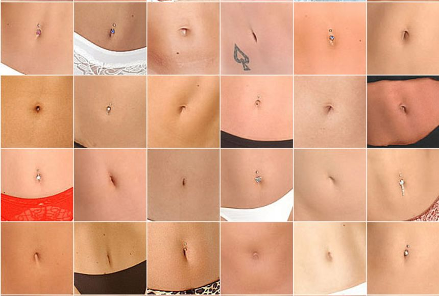

# Belly Button Biodiversity Dashboard

Using the D3 Javascript library to build an interactive dashboard that can explore the microbes that colonise human navels.

# Project Overview

The Belly Button Biodiversity Dashboard project is an interactive web application designed to visualize the microbial species, also known as operational taxonomic units (OTUs), found in human navels. This project leverages the D3 library to read and manipulate data, and uses this data to create dynamic and interactive visualizations.

The dashboard includes a horizontal bar chart and a bubble chart. The bar chart displays the top 10 OTUs found in an individual, with a dropdown menu for user selection. The bubble chart provides a more detailed view of each sample, using OTU IDs for the x-axis values, sample values for the y-axis and marker size, and OTU labels for the text values.

In addition to these visualizations, the dashboard also displays an individual’s demographic information, providing a more comprehensive view of the data. This information is dynamically updated when a new sample is selected from the dropdown menu.

The project is hosted on GitHub Pages, providing a publicly accessible platform for users to interact with the dashboard. The repository follows best practices for version control, with regular commits and a thorough README.md file for documentation.

This project not only provides valuable insights into the biodiversity of microbes in human navels but also serves as a practical application of data manipulation and visualization techniques. It demonstrates the power of D3 in creating dynamic and interactive web applications, and the importance of good version control and documentation practices.

#
## Features
  * Interactive bar chart showing the top 10 OTUs found in an individual
  * Bubble chart displaying each sample
  * Gauge chart showing the washing frequency
  * Demographic information panel

##  
